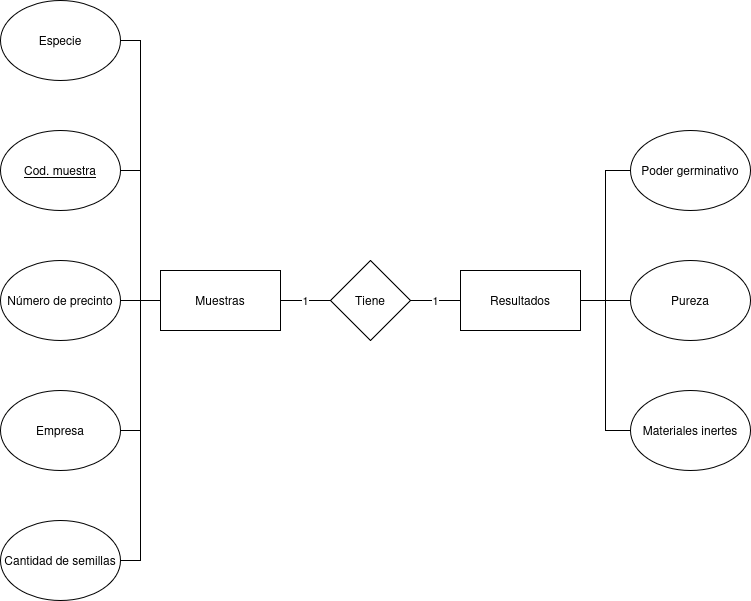

# Registro de semillas
Registra y gestiona muestras de semillas recibidas. Cada muestra contiene información sobre su origen y posteriormente se le asocian resultados de análisis.


# Solucion implementada

Se utilizo el plugin $Bake$ del composer de CakePHP para generar la plantilla.

Se crearon dos tablas:

<div align="center">

</div>

En la tabla de resultados tanto la $pureza$ como $poder\_germinativo$ son floatantes que van desde el 0.00 hasta el 1.00, con saltos de 0.01.


# Requerimientos

## Base de datos

1. Crear la base de datos.
Ejemplo (en mysql ```sudo mysql -u root -p```) :
```sql
CREATE DATABASE <nombre de la BDD> CHARACTER SET utf8mb4;
GRANT ALL PRIVILEGES ON <nombre de la BDD>.* TO '<nombre de usuario>'@'localhost';
FLUSH PRIVILEGES;
EXIT;
```
Recordar remplazar los campos del ejemplo si se utiliza.

2. Copiar ```config/app_local.example.php``` en la misma carpeta y renombrarlo como ```app_local.php```.

3. Actualizar los valores de '$username$', '$password$' y '$database$' con los valores de la creacion de la base de datos
en ```config/app_local.php```.

4. Crear las tablas "Muestras" y "Resultados"

```sql
DROP TABLE IF EXISTS resultados;
DROP TABLE IF EXISTS muestras;


CREATE TABLE muestras (
  codigo_de_muestra VARCHAR(255) NOT NULL PRIMARY KEY,
  especie VARCHAR(220) NOT NULL,
  numero_de_presinto INT NOT NULL,
  empresa TEXT NOT NULL,
  cantidad_de_semillas INT,
  fecha_resgistro DATETIME DEFAULT CURRENT_TIMESTAMP,
  fecha_modificado DATETIME DEFAULT CURRENT_TIMESTAMP ON UPDATE CURRENT_TIMESTAMP,
  fecha_extraccion DATE NULL DEFAULT NULL,
  CHECK (cantidad_de_semillas > 0),
  CHECK (numero_de_presinto >= 0)
) ENGINE=InnoDB DEFAULT CHARSET=utf8mb4;


CREATE TABLE resultados (
  codigo_de_muestra VARCHAR(255) NOT NULL PRIMARY KEY,
  poder_germinativo FLOAT NOT NULL,
  pureza FLOAT NOT NULL,
  materiales_inertes LONGTEXT NOT NULL,
  FOREIGN KEY (codigo_de_muestra) REFERENCES muestras(codigo_de_muestra) ON DELETE CASCADE,
  CHECK (poder_germinativo >= 0.0 and poder_germinativo <= 1.0),
  CHECK (pureza >= 0.0 and pureza <= 1.0)
) ENGINE=InnoDB DEFAULT CHARSET=utf8mb4;
```

El mismo codigo esta en el script ```Script-semillas.sql```.


## Cargar el servidor

1. Abrir la terminal en la carpeta ```cake_app```.
2. Ejecutar el comando ```bin/cake server -p 8765```.
3. Abrir el link ```http://localhost:8765``` donde se abrira la pagina de inicio.

## Posibles problemas

### Permisos adicionales

Es posible que se requieran permisos adicionales para ejecutar el comando para iniciar el servidor.

```bash
sudo chown -R $USER:www-data tmp logs
sudo chmod -R 775 tmp logs
```

### Advertencia en la paguina principal

Es posible que aparesca un cartel de error en las paginas por la conexion de la base de datos.

```bash
sudo apt install php-sqlite3
sudo systemctl restart apache2   # o reiniciar PHP-FPM
```

## Version

CakePHP 5.2.9