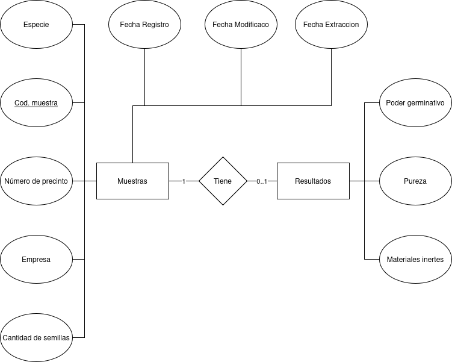

# Registro de semillas
Registra y gestiona muestras de semillas recibidas. Cada muestra contiene información sobre su origen y posteriormente se le asocian resultados de análisis.


# Solucion implementada

Se crearon dos tablas:

<div align="center">

</div>


# Requerimientos

## Base de datos

1. Crear la base de datos.

2. Copiar ```config/app_local.example.php``` en la misma carpeta y renombrarlo como ```app_local.php```.

3. Actualizar los valores de '$username$', '$password$' y '$database$' con los valores de la creacion de la base de datos
en ```config/app_local.php```.


4. Crear las tablas "Muestras" y "Resultados"

```

CREATE TABLE muestras (
  codigo_de_muestra INT AUTO_INCREMENT PRIMARY KEY,
  especie VARCHAR(255) NOT NULL,
  numero_de_presinto INT NOT NULL,
  empresa TEXT NOT NULL,
  cantidad_de_semillas INT,
  CHECK (cantidad_de_semillas > 0),
  CHECK (numero_de_presinto >= 0)
);


CREATE TABLE resultados (
  codigo_de_muestra INT PRIMARY KEY,
  poder_germinativo FLOAT NOT NULL,
  pureza FLOAT NOT NULL,
  materiales_inertes LONGTEXT NOT NULL,
  FOREIGN KEY (codigo_de_muestra) REFERENCES muestras(codigo_de_muestra) ON DELETE CASCADE,
  CHECK (poder_germinativo >= 0.0 and poder_germinativo <= 1.0),
  CHECK (pureza >= 0.0 and pureza <= 1.0)
);

```
## Cargar el servidor

4. Abrir la terminal en la carpeta ```cake_app```.
5. Ejecutar el comando ```bin/cake server -p 8765```.

## Version

CakePHP 5.2.9